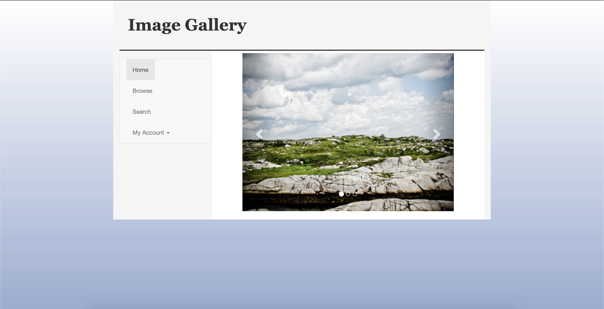

```
# Lab4设计文档
___
+ 概述
    - 一共分为三个部分，最上方是header，这里没有使用框架。  
    下方的左边是float：left的nav，即导航栏  
    下方的右边是main，简单的做成了图片轮播
+ nav部分
  - class="navbar navbar-default"  
  用这个框架实现hover等效果，同时实现My Account的下拉菜单效果
+ main部分
    - data-interval设置自动变化的时间2000毫秒
    - data-pause = "hover"设置鼠标放上去会停止轮播的是hover
    - data-wrap="true" 设置循环轮播
    - data-slide="next"设置该区域被点击执行向后的操作
    - data-slide="prev"设置该区域被点击执行向前的操作  
    **通过以上实现图片的轮播等效果**
+ 为了简单起见，没有继续写footer部分  
___
**下面附上我的主页截图**  
     
```
