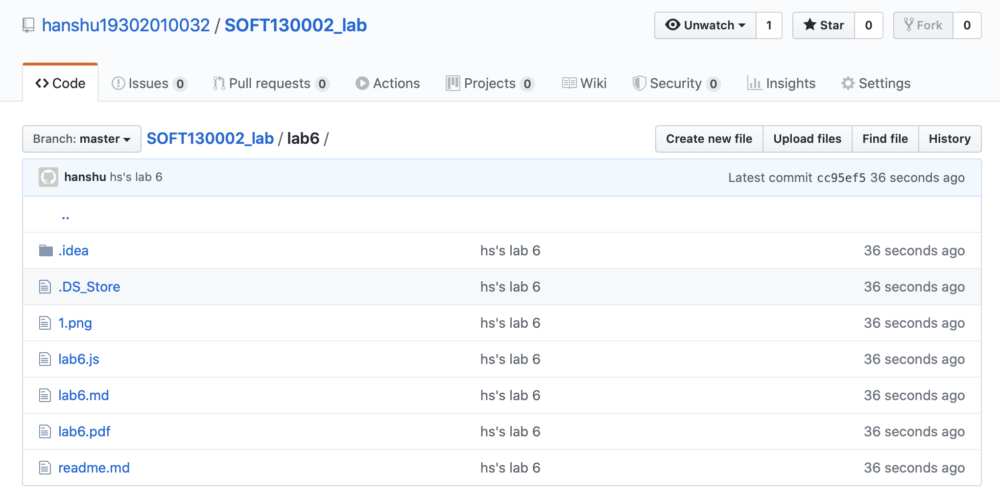
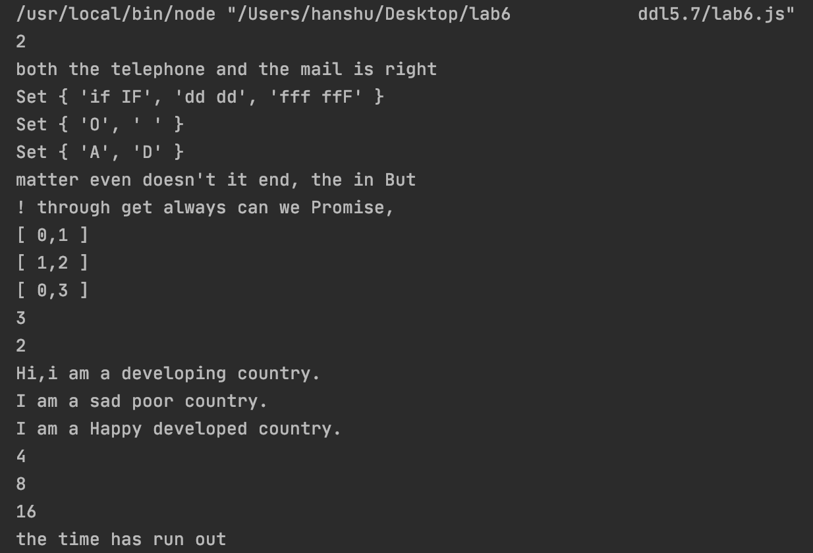

#lab6设计文档  

 ##MAP、Set、Array

 -  Map：  
 是一组键值对的结构，具有极快的查找速度。通过传入数组的数组来建立。  
 -  Set：  
和Map类似，也是一组key的集合，但不存储value。
由于key不能重复，所以，在Set中，没有重复的key。
要创建一个Set，需要提供一个Array作为输入或者直接创建一个空Set。
add方法很方便
-   Array：  
传统数组

##第一题  
相比上一次，我就内置了一个新函数，原函数返回改新函数即可  
另外，加一个判断，便于输出到达下一分钟
##第二题  
- 手机号的正则判断：/^1[3456789]\d{9}$/  
      意思是第一位为1，第二位不是1或2或0，后面九位只要是数字即可
-   邮箱的正则判断：/^([a-zA-Z0-9._-])+@([a-zA-Z0-9_-])+(\.[a-zA-Z0-9_-])+/  
@前面是字母，数字，点，下划线，杠；@以后同
##第三题
首先把字符串按照空格分成一个一个单词  
然后判断后一项是不是和前一项一样，如果一样，将两者列为同一个元素再输出  
同时也需要判断是不是长度已经到了10
##第四题
首先把字符串分成字符  
其实就是寻找消失了哪些字母  
最后转化成大写字母输出
##第五题
首先把字符串按照空格分成单词（连标点一起）  
建立一个新数组，倒序接受原数组  
由于用" "分割，所以不需要考虑本来产生两个空格咋办  
这里擅自做主把数组整合成字符串再输出了
##第六题
弄成Map以后直接寻找是不是存在（target-它本身）就行  
##第七题
如果在现存的最长子串找不到新的字符，就在老子串上加上，形成新子串，并得到其长度  
继续循环即可
##第八题
-   原型链继承  
对实例对象属性直接赋值，即使当前实例没有此属性，会自动在实例对象里面新增此属性，并不会在原型链上找  
-   构造函数继承  
使用call改变Child中this指向，相当于把Parent中所有属性方法全部一股脑copy过来成为Child中的方法。  
-   Object.create  
将参数proto指定的原型对象赋值给新对象的[[Prototype]]。
如果参数为null的话，Object.create则会创建没有很合属性空对象

